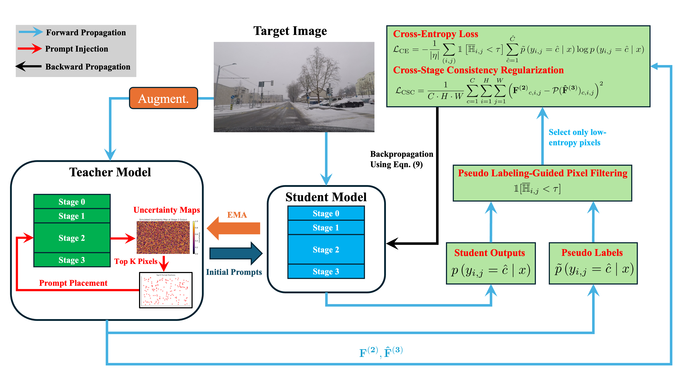

# GaPaTTA

Official implementation for the paper:
"GaPaTTA: Gaussian Entropy-Guided Prompt Placement for Test-Time Adaptation in Semantic Segmentation"
(Springer Machine Learning 2026)


## Overview

<p align="center">
  
</p>

## Prepare Dataset and Checkpoints
Follow the SVDP reposory https://github.com/Anonymous-012/SVDP

## Reproduce

```bash
bash bash/GaPaTTA.sh
```

## Citation
```bibtex
@article{b2883be255754cf4997fab4750c1dacb,
title = "GaPaTTA: Gaussian Entropy-Guided Prompt Placement for Continual Test-Time Adaptation in Semantic Segmentation",
author = "Jixiang Lei and Franz Pernkopf",
year = "2025",
language = "English",
journal = "Machine Learning",
issn = "0885-6125",
publisher = "Springer Netherlands",
}
```

## Acknowledgement

This repository is based on and derived from the implementation accompanying
the paper **SVDP** (https://github.com/Anonymous-012/SVDP).
